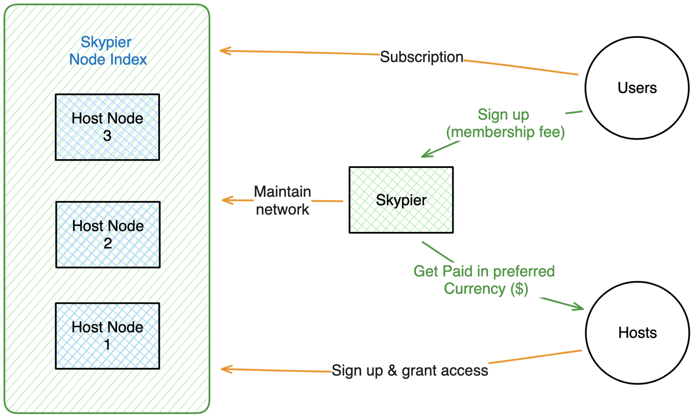

<!-- About -->

## How Skypier work?

Skypier is a community-based marketplace for listing internet access points, **Nodes**, such as WiFi hotspots, and rerouting internet traffic through these Nodes in encrypted channels. We have developed a secure communication protocol to ensure a private peer-to-peer (P2P) connection beyond just messages like WhatsApp, Signal, or Telegram. This means it can handle the high throughput requirements in applications such as streaming and gaming. Any internet-connected device can be a peer, e.g., phone, laptop, tablet, IoT devices such as Roomba and Smart TV, etc.

🔐 ***Our protocol is serviceable to both Enterprise as well as individuals. For Enterprise services, please see the Enterprise section below.***

There are generally two types of peers in our marketplace: host and client users. A **Host** user is anyone who leases out a portion of their internet bandwidth, and a **Client** user is anyone who subscribes to access the internet through a Host’s Node. The Host would then earn from the Client's subscription fee. As a marketplace, we connect hosts and clients and facilitate the process of rerouting the Client’s internet traffic, cultivating a sharing economy by allowing Node Hosts to rent out their unused or underused bandwidth.

<!--  -->

### Enterprise Services
Recognizing the desire to have control over the network infrastructure, we offer enterprise-level service for organizations to self-manage their IT security. As a privacy stack with Zero-Trust access control, we can help you secure and protect your data through purposeful data fragmentation and encryption. For more information about our Enterprise Support, please reach out through the **[Inquiry Form](/#contact)** and discuss how we can strengthen your organization's security infrastructure.

## Skypier FAQ

Host FAQ

- **How may I qualify to be a Host?**

    The main requirements are a stable internet with an upload speed of 50 mbps or higher, and a computer that is on and connected constantly.
- **How much may I earn as a Host?**

    This may vary due to a number of factors, such as the supply and demand for your location and internet speed.
- **What if we don’t have a computer that can connect to the internet constantly?**

    We are currently developing a solution so that you may use a low-cost computer such as a Raspberry Pi. We will share an update once it’s available!

Client FAQ

- **How would I know if the Node I am connecting to is not a owned by a bad person?**

    We are implementing a Host scoring system so that you can see their internet quality and if they have been reported with negative reviews. 

Enterprise FAQ

    Coming Soon…

